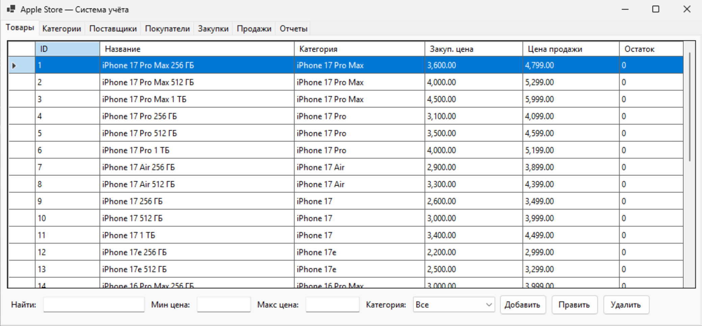
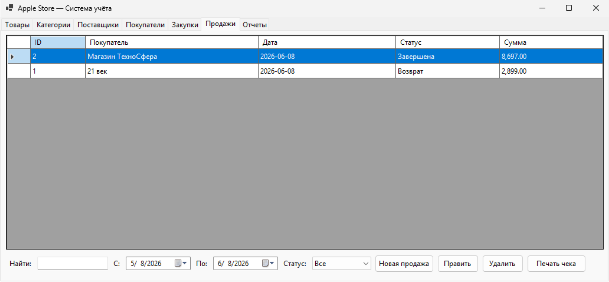
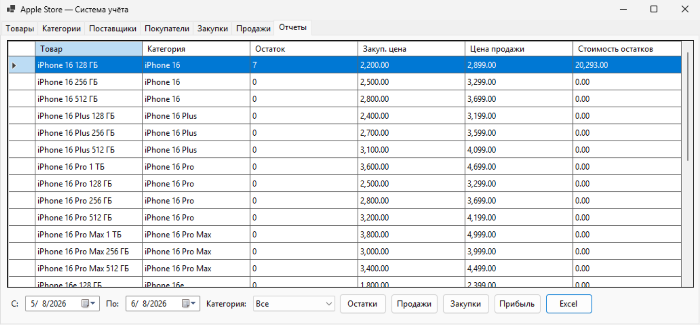
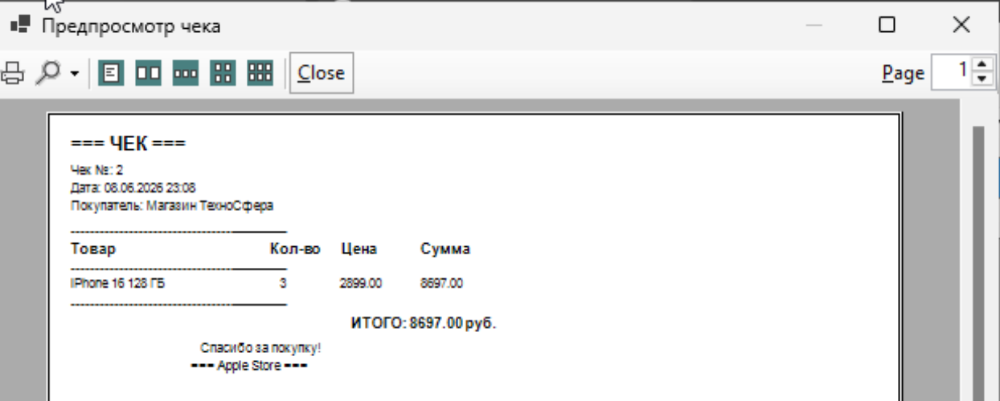
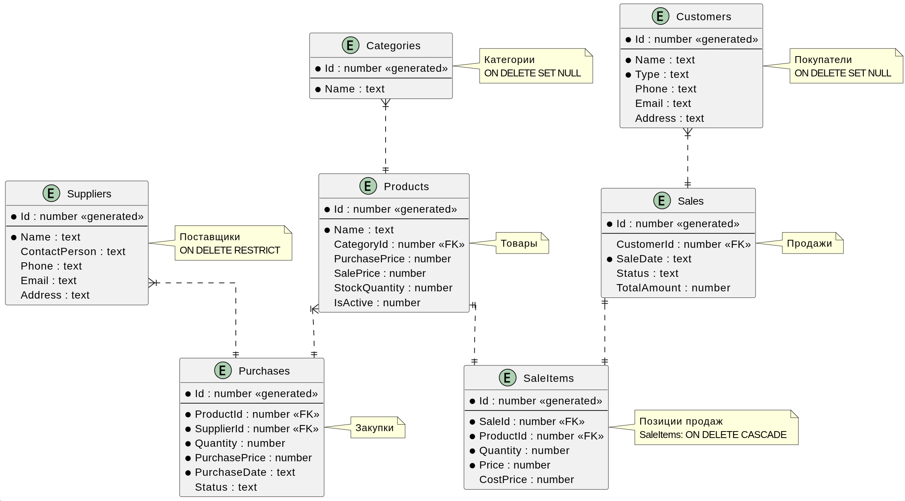

# 📱 Apple Store — Система учёта


MVP десктопного приложения для автоматизации складского учёта магазина техники Apple. Пет-проект для пробования фреймворка **C# WinForms** 

---

## 🖼️ Интерфейс

### Главная форма


### Товары


### Продажи


### Отчёты


### Печать чека



---

## 📦 Используемые библиотеки (NuGet)

Все пакеты уже прописаны в `Apple/Apple.csproj`, но при необходимости их можно установить вручную через **Package Manager Console** или **dotnet CLI**.

### 🔧 Установка через `dotnet CLI`

```bash
dotnet add package ClosedXML --version 0.105.0
dotnet add package Microsoft.Data.Sqlite --version 10.0.8
dotnet add package Microsoft.Data.SqlClient --version 7.0.1
dotnet add package System.Data.SqlClient --version 4.9.1
```

### 📋 Установка через Package Manager Console (Visual Studio)

```powershell
Install-Package ClosedXML -Version 0.105.0
Install-Package Microsoft.Data.Sqlite -Version 10.0.8
Install-Package Microsoft.Data.SqlClient -Version 7.0.1
Install-Package System.Data.SqlClient -Version 4.9.1
```

### 📖 Назначение библиотек

| Библиотека | Зачем нужна |
|---|---|
| **ClosedXML** | Генерация настоящих `.xlsx`-файлов Excel с форматированием, автофильтром, «зеброй» и закреплёнными строками |
| **Microsoft.Data.Sqlite** | Современный ADO.NET-провайдер для работы с SQLite (поддержка `PRAGMA`, транзакций, параметризованных запросов) |
| **Microsoft.Data.SqlClient** | Драйвер для Microsoft SQL Server (зарезервирован для возможного перехода на SQL Server в будущем) |
| **System.Data.SqlClient** | Совместимость с legacy-кодом и `DataTable` |

---

## 🗄️ Структура базы данных

База данных SQLite (`apple.db`) автоматически создаётся при первом запуске в папке:

```
%APPDATA%\Apple\apple.db
```

> 📌 *На Windows это обычно:* `C:\Users\<ИмяПользователя>\AppData\Roaming\Apple\apple.db`

### 📐 Схема БД



### 📑 Основные таблицы

```sql
-- Категории товаров
Categories (Id, Name)

-- Поставщики
Suppliers (Id, Name, ContactPerson, Phone, Email, Address)

-- Покупатели (розничные / оптовые)
Customers (Id, Name, Type, Phone, Email, Address)

-- Товары (поддержка Soft Delete через IsActive)
Products (Id, Name, CategoryId, PurchasePrice, SalePrice, StockQuantity, IsActive)

-- Закупки (статусы: Оформлена / Возврат)
Purchases (Id, ProductId, SupplierId, Quantity, PurchasePrice, PurchaseDate, Status)

-- Продажи (статусы: Завершена / Отменена / Возврат)
Sales (Id, CustomerId, SaleDate, Status, TotalAmount)

-- Позиции продаж с себестоимостью на момент продажи
SaleItems (Id, SaleId, ProductId, Quantity, Price, CostPrice)
```

### 🔗 Связи (Foreign Keys)

- `Products.CategoryId` → `Categories.Id` (ON DELETE SET NULL)
- `Purchases.ProductId` → `Products.Id` (ON DELETE RESTRICT)
- `Purchases.SupplierId` → `Suppliers.Id` (ON DELETE RESTRICT)
- `Sales.CustomerId` → `Customers.Id` (ON DELETE SET NULL)
- `SaleItems.SaleId` → `Sales.Id` (ON DELETE CASCADE)
- `SaleItems.ProductId` → `Products.Id` (ON DELETE RESTRICT)

### 💡 Особенности БД

- ✅ **WAC (Weighted Average Cost)** — при каждой закупке пересчитывается средневзвешенная себестоимость товара.
- ✅ **Сохранение себестоимости в момент продажи** — `SaleItems.CostPrice` фиксирует цену на момент продажи для корректного расчёта прибыли.
- ✅ **Soft Delete** — товары не удаляются физически, а помечаются как неактивные (`IsActive = 0`), чтобы сохранить финансовую историю.
- ✅ **Авто-миграции** — при открытии старой БД приложение автоматически добавляет недостающие колонки (`IsActive`, `Status`, `CostPrice`).
- ✅ **Seed-данные** — при первом запуске заполняются 10 категорий, 12 поставщиков, 20 покупателей и 28 моделей iPhone.

---

## ⚙️ Функционал

### 📋 7 вкладок приложения

| # | Вкладка | Возможности |
|---|---|---|
| 1 | **Товары** | Поиск, фильтры по цене и категории, добавление/редактирование, soft delete |
| 2 | **Категории** | CRUD-операции с категориями |
| 3 | **Поставщики** | Управление поставщиками и контактами |
| 4 | **Покупатели** | Розничные и оптовые покупатели, фильтр по типу |
| 5 | **Закупки** | Оформление закупок, возврат поставщику, фильтры по датам и поставщику |
| 6 | **Продажи** | Многопозиционные продажи, возвраты, отмены, **печать чеков** |
| 7 | **Отчёты** | Остатки, Продажи, Закупки, Прибыль + **экспорт в Excel** |

### 📊 Типы отчётов

- **Остатки** — текущий склад с оценкой стоимости остатков
- **Продажи** — детализация продаж за период
- **Закупки** — история поступлений
- **Прибыль** — выручка, себестоимость и прибыль по каждому товару (фильтр по категории и датам)

### 🖨️ Печать чеков

Кликабельная печать чека через `PrintDocument` с предпросмотром (`PrintPreviewDialog`). В чеке: номер, дата, покупатель, список товаров с количеством и ценой, итоговая сумма.

### 📤 Экспорт в Excel

Настоящий `.xlsx` через **ClosedXML** со всеми плюшками:
- Заголовок отчёта крупным шрифтом
- Дата формирования
- Синие шапки с белым текстом
- «Зебра» (чередование строк)
- Автофильтр
- Закреплённая строка заголовков
- Автоширина колонок
- Форматы чисел (`#,##0.00`) и дат (`dd.MM.yyyy HH:mm`)

---

## 🚀 Запуск проекта

### Требования
- Windows 10 / 11
- .NET 10 SDK ([скачать](https://dotnet.microsoft.com/download/dotnet/10.0))
- Visual Studio 2022 (17.12+) **или** VS Code / Rider

### Публикация в EXE (self-contained)

```bash
dotnet publish Apple/Apple.csproj -c Release -r win-x64 --self-contained true -p:PublishSingleFile=true
```

Готовый `.exe` появится в `Apple/bin/Release/net10.0-windows/win-x64/publish/`.

---

## 📁 Структура проекта

```
Apple/
├── Apple.slnx                 # Решение (solution)
├── README.md                  # Этот файл
└── Apple/
    ├── Apple.csproj           # Проект (.NET 10, WinForms)
    ├── Program.cs             # Точка входа
    ├── App.cs                 # Логика главной формы
    ├── App.Designer.cs        # Размещение элементов UI (авто-генерация)
    ├── App.resx               # Ресурсы формы
    └── DatabaseHelper.cs      # Работа с SQLite (CRUD, отчёты, миграции)
```